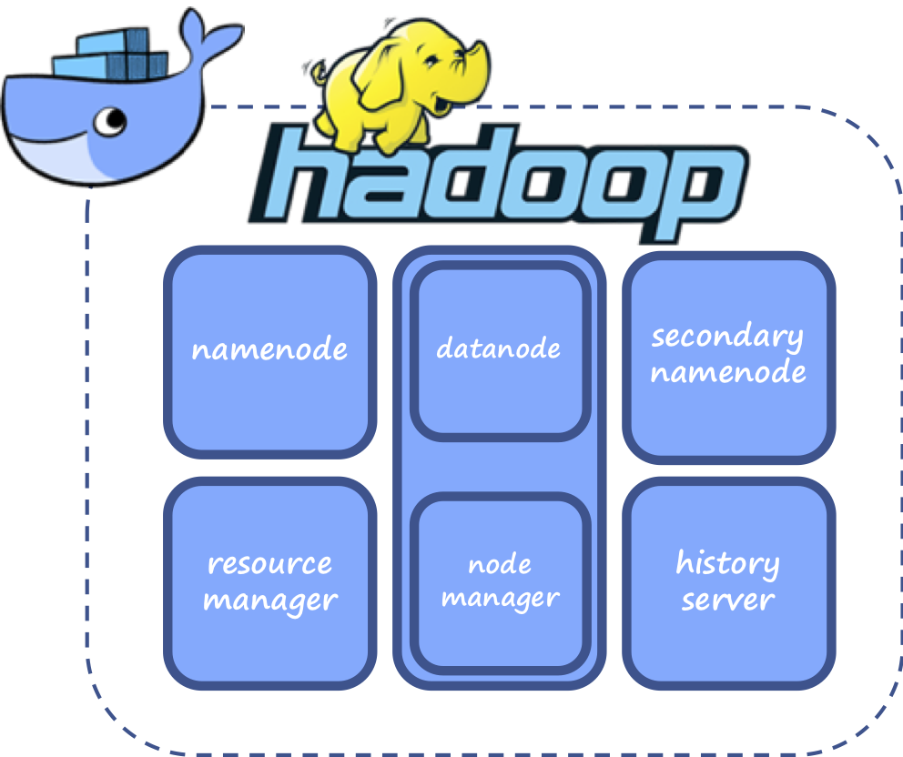

# Hadoop Docker
> a big data microservice cluster

A docker microservice ecosystem for a baseline Hadoop 2.0 cluster.



## Pre-requisites

- [docker](https://docs.docker.com/install/) (1.13.0+)
- [docker-compose](https://docs.docker.com/compose/install/) (3+)

## Quickstart

Prepare cluster:
```sh
> docker-compose run namenode ./format.sh
```
*NOTE: this step should build the base and daemon images if you have not already*

Start cluster:
```sh
> docker-compose up -d
```

Cluster status:
```sh
> docker-compose ps
           Name                         Command               State                         Ports
-----------------------------------------------------------------------------------------------------------------------
hadoop_base_1                /bin/bash                        Exit 0
hadoop_daemon_1              /bin/bash                        Exit 0
hadoop_datanode1_1           ./start.sh hadoop datanode       Up       0.0.0.0:50075->50075/tcp, 0.0.0.0:8042->8042/tcp
hadoop_datanode2_1           ./start.sh hadoop datanode ...   Up       0.0.0.0:50076->50075/tcp, 0.0.0.0:8043->8042/tcp
hadoop_historyserver_1       ./start.sh mr-jobhistory h ...   Up       0.0.0.0:19888->19888/tcp
hadoop_namenode_1            ./start.sh hadoop namenode       Up       0.0.0.0:50070->50070/tcp
hadoop_resourcemanager_1     ./start.sh yarn resourcema ...   Up       0.0.0.0:8088->8088/tcp
hadoop_secondarynamenode_1   ./start.sh hadoop secondar ...   Up       0.0.0.0:50090->50090/tcp
```

Stop cluster:
```sh
> docker-compose down
```

## Project structure

The docker image inheritance tree is as follows:
```
----base: core Hadoop binaries are installed here
    |---daemon: configuration files for Hadoop are installed here
    |   |---namenode: Hadoop Namenode
    |   |---datanode1: First Hadoop Datanode with YARN NodeManager
    |   |---datanode2: Second Hadoop Datanode with YARN NodeManager
    |   |---datanodeN: More Hadoop Datanodes with YARN NodeManager, as you wish
    |   |---secondarynamenode: Hadoop SecondaryNameNode
    |   |---resourcemanager: YARN Resource Manager
    |   |---historyserver: YARN Timeline History Server
    |   |---<subproject>: Any related Hadoop subproject where Hadoop is a dependency
```

The folder structure closely follows the Docker image inheritance:
```
|----base/: OS installation scripts for various versions of Hadoop and Java
|----daemon/: site configuration files and startup scripts
|---data/: data folders mounted to the data folders with NameNode, DataNodes, and SecondaryNameNodes containers (this allows data persistence in the cluster)
|---logs/: log folders for all running containers
|---docker-compose.yml: architecture file, where you can set service hostnames, ports, mounted folders, etc.

```
## Endpoints
- NameNode: http://localhost:50070
- DataNode1: http://localhost:50075
- NodeManager1: http://localhost:8042
- DataNode2: http://localhost:50076
- NodeManager1: http://localhost:8043
- SecondaryNameNode: http://localhost:50090
- YARN Resource Manager: http://localhost:8088
- HistoryServer: http://localhost:19888

## Tests
While the cluster is running (`docker-compose up -d`), you can log into any one of the containers to access the Hadoop API.

### Ingest file
```sh
> docker-compose exec namenode /bin/bash
[root@namenode tmp] hdfs dfs -mkdir /in # <-- you are now executing commands within the container
[root@namenode tmp] curl -o book.txt http://www.gutenberg.org/files/2701/2701-0.txt
  % Total    % Received % Xferd  Average Speed   Time    Time     Time  Current
                                 Dload  Upload   Total   Spent    Left  Speed
100 1246k  100 1246k    0     0  1846k      0 --:--:-- --:--:-- --:--:-- 1846k
[root@namenode tmp] hdfs dfs -copyToLocal ./book.txt /in
[root@namenode tmp] hdfs dfs -ls /in/
```

### Perform a MapReduce operation on the file
```sh
[root@namenode tmp] yarn jar /usr/local/hadoop/hadoop/share/hadoop/mapreduce/hadoop-mapreduce-examples-$HADOOP_VER.jar wordcount /in /out
<MapReduce log output here>
<Can use ResourceManager and/or HistoryServer to track (http://localhost:8088 or http://localhost:19888)>
[root@namenode tmp] hdfs dfs -cat /out/part-r00000
```

